# Task1的笔记在这里

## 1.1 Hello, `MySQL`!

​	依旧看不懂/.


- 什么是数据库表？
- 怎么写数据库表？
- 不懂，反正要学`MySQL`了

### 1.1.1 先下载😡😡😡

​	先去官网找个Documentation看看吧


​	一通捣鼓之后，成功了！


### 1.1.2 在哪写😵‍💫😵‍💫😵‍💫

- 先看看怎么能用`VS Code`来连接到我的``MySQL``数据库

  需要用到一个扩展:  `MySQL`

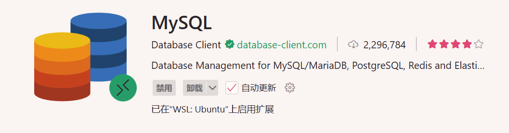

- 然后编写好相应的数据

  主机名就是`MySQL`服务器所在主机的Host，因为我是通过远程连接`WSL`打开的`VS Code`，所以这里填本地的环回地址`123.0.0.1`就可以了

  端口没做修改的话就是默认的3306

  用户名和密码就正常填即可

  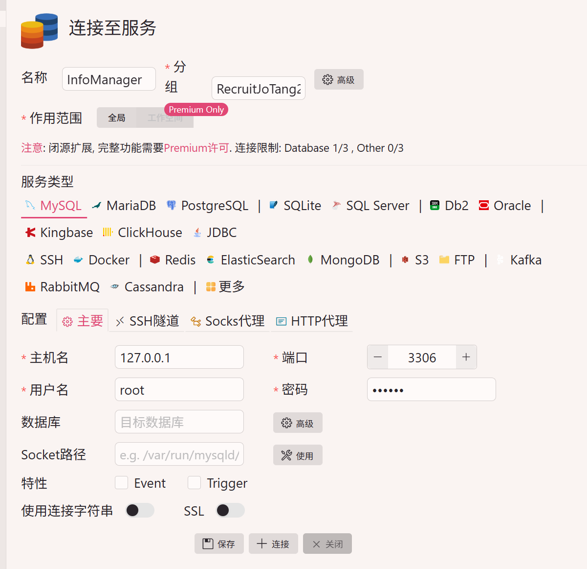

- 然后我们就连接成功了

  

### 1.1.3 写什么❓❓❓

- 一些浅层的理解

  针对`MySQL`数据库的一切操作都是通过这个数据库的终端来执行的

  而我们编写的`.sql`文件实则就是一堆命令的集合，类似于`Windows`中的`.bat`文件

  所以接下来要学的，就是`MySQL`中都有哪些命令

#### 1.1.3.1 数据库操作

- 有什么基本操作？

  ```mysql
  -- 查询所有数据库
  SHOW DATABASES;
  -- 查询当前数据库
  SELECT DATABASE();
  -- 使用数据库
  USE <name>;
  -- 创建数据库
  CREATE DATABASE [IF NOT EXISTS] <name>;
  -- 删除数据库
  DROP DATABASE [IF EXISTS] <name>;
  ```

#### 1.1.3.2 表结构操作

- 有什么基本操作 ？

  ```mysql
  -- 创建表
  -- <col_attribute>属性，包括了数据类型、约束、位置、注释等等信息
  CREATE TABLE [IF NOT EXISTS] <name> (
    <col_name> <col_attribute>, 
    <col_name> <col_attribute>,
      ...	
      <table_constraint> -- 表级约束条件
  ) [ENGINE = InnoDB] [DEFAULT CHARSET=utf8mb4]; -- InnoDB是一种数据库引擎，默认用这个就行，utf8mb4是一种字符集
  
  -- 重命名表
  RENAME TABLE <name> TO <new_name>
  
  -- 查询表结构
  DESC <name>
  
  -- 查询所有表
  SHOW TABLES
  
  -- 修改表
  ALTER TABLE <name>
    ADD [COLUMN] <col_name> <col_attribute>, -- 增加列
    DROP [COLUMN] <col_name>,	-- 删除列
    CHANGE [COLUMN] <col_name> <another_col_name> <col_attribute>, -- 修改列的名字和定义，必须重新指定其定义
    MODIFY [COLUMN] <col_name> <col_attribute>, -- 修改列的定义，必须重新指定其定义
    RENAME [COLUMN] <col_name> TO <new_name>; -- 修改列的名字
    ADD CONSTRAINT <constraint> -- 增加表级约束条件
    
  -- 清空表（只清空内容，不改变结构）
  TRUNCATE TABLE <name>;
  DELETE FROM <name>;
  
  -- 删除表
  DROP COLUMN <name>;
  ```
  
- 什么是数据类型？

  >**数据类型（Data Type）**定义了数据在数据库中的存储格式、取值范围以及可执行的操作。
  >
  >​	——DeepSeek R1

  常用以下数据类型

  ```mysql
  -- 数值类
  TINYINT -- 一字节整数
  SMALLINT -- 二字节整数
  INT -- 四字节整数
  BIGINT -- 八字节整数
  DOUBLE -- 双精度浮点数
  DECIMAL(M, D) -- 精确存储小数，M为总位数，D为小数位数
  
  -- 字符类
  CHAR(N) -- 固定长度为N的字符串
  VARCHAR (N) -- 最大长度为N的字符串
  TEXT -- 长文本
  
  -- 时间类
  DATE -- 'YYYY-MM-DD'
  TIME -- 'HH:MM:SS'
  DATETIME -- 'YYYY-MM-DD HH:MM:SS'
  TIMESTAMP -- 时间戳
  
  -- 枚举与集合类
  ENUM('val1', 'val2', ...) -- 枚举类型，预定值中多选一
  SET('val1', 'val2', ...) -- 枚举类型，预定值中多选多
  ```

  

- 什么是约束条件？

  > **约束条件（Constraints）** 是强制存储在表中的数据必须满足的**规则**。
  > ​	——DeepSeek R1

  常用以下约束条件
  ```mysql
  -- 主键，确保表中所有行的此值都唯一，并且不为空
  PRIMARY KEY
  
  -- 外键，这个值必须存在于另一张表的主值或唯一值中
  FOREIGN KEY <another_table>(<col_name>)
  
  -- 唯一，确保表中所有行的此值都是唯一，无视空值
  UNIQUE
  
  -- 非空，确保此值不是空值
  NOT NULL
  
  -- 检查，确保此值满足某个表达式
  CHECK <expression>
  
  -- 默认，为此值自动添加默认值
  DEFAULT <expression>
  
  -- 自动更新，当其他列被修改时，该列自动修改为某个值
  ON UPDATE <expression> 	 		
  ```

- 此外还有一些常用属性

  ``` mysql
  -- 添加注释
  COMMENT 'message'
  
  -- 自增，通常用于生成唯一的id
  AUTO_INCREMENT
  
  -- 在某列前/后，用于标明列的位置
  FIRST <another_col_name>
  AFTER <another_col_name>
  ```

#### 1.1.3.3 数据操作

- 在表中插入/修改/删除数据

  ```mysql
  -- 插入数据
  INSERT INTO <table_name> (<col1, col2, ...>) VALUES (<val1, val2, ...>) -- 指定列插入数据
  INSERT INTO <table_name> VALUES (<val1, val2, val3, ...>) -- 给全部列依次添加数据
  INSERT INTO <table_name> (<col1, col2, ...>) VALUES (<val1, val2, ...>), (<val1, val2, ...>),... -- 批量给指定列插入数据
  INSERT INTO <table_name> VALUES (<val1, val2, ...>), (<val1, val2, ...>), ... -- 批量给全部列依次插入数据
  
  -- 修改数据
  UPDATE <table_name> SET <col1> = <val1>, <col2> = <val2>, ... WHERE <condition> -- 将满足条件的数据进行修改
  
  -- 删除数据
  DELETE FROM <table_name> WHERE <condition> -- 将满足条件的数据进行删除
  ```
  
- 数据查询

  ```mysql
  -- 基础语法
  SELECT <col1>, <col2>, .. FROM <table_name1>, <table_name2>, .. -- 查询指定表的对应列
  
  -- 附加语法
  * -- <col1>, <col2>, ...可被替换成 * 来指代所有列
  AS '<alias>' -- 在 <col> 后附加 AS '<alias>' 可以为列起别名，AS 可省略
  DISTINCT -- 在 SELECT 后附加 DISTINCT ，可以忽略掉重复项	
  WHERE <condition> -- 在分组前过滤不满足条件的行，不能使用聚合函数运算
  GROUP BY <col1>, <col2>, ... -- 将查询结果按列分组
  HAVING <condition> -- 在分组后过滤不满足条件的行，可以使用聚合函数运算
  ORDER BY <col1> <ASC/DESC>, <col2> <ASC/DESC>, ... -- 将结果按列进行升序/降序排序 
  LIMIT <offset>, <count> -- 显示偏移量后指定数目的行 
                          -- 分页公式: LIMIT (页码 - 1) * 每页数量, 每页数量
  ```
  
  ```mysql
  -- 聚合函数
  COUNT(<expression>) -- 计算满足条件的非空数据的行数。若 <expression> 为 * ，则计算总行数
  SUM(<col>) -- 计算指定列的数值总和
  AVG(<col>) -- 计算指定列的数值平均数
  MAX(<col>) -- 计算指定列的数值/字符串/日期最大值
  MIN(<col>) -- 计算指定列的数值/字符串/日期最小值
  ```
  
  ```mysql
  -- 条件怎么写
  
  -- 基础比较运算符
  =, !=, >, <, >=, <= -- 等于，不等于，大于，小于，大于等于，小于等于
  
  -- 基础逻辑运算符
  AND, OR, NOT -- 与，或，非
  
  -- 特殊运算符
  BETWEEN ... AND ... -- 查询某个范围内的值
  IN (...) -- 查询指定列表中的值
  LIKE <string> -- 模糊匹配字符串，'%'代表任意多个任意字符，'_'代表一个任意字符
  ```

### 1.1.4 开始写😀😀😀

​	在学了一大堆东西：

- 首先是搞清楚了在哪里能方便地写`MySQL`

- 接着是搞清楚了要写个表会用到什么语句

​	之后，我终于能开始写自己的表了！！！

#### 1.1.4.1 打个草稿✍️✍️✍️

​	先稍微组织一下都要写哪些表、这些表都有哪些列

 - 用户`user`
   - 用户ID`user_id`
   - 权限`priviledge` : `admin/user`, 用于管理用户权限
   - 状态`status`: `active/inactive/suspended`, 激活/注销/封禁, 用于管理用户状态
   - 用户名`username`
   - 密码`password`: 使用Bcript加密(Bcript是什么之后再学)
   - 邮箱`email`: 唯一
   - 手机号`mobile`: 唯一
   - 注册时间`create_time`: 用户注册的时间
   - 更新时间`update_time`: 用户信息更新的时间
 - 商品`product`
   - 商品ID`product_id`
   - 名称`product_name`
   - 描述`product_description`
   - 价格`price`
   - 发布者ID`publisher_id`
   - 类型`type`: `item/service`
   - 状态`status`: `sold/unsold`
   - 发布时间`create_time`
   - 更新时间`update_time`
 - 商品订单`product_order`
   - 订单ID`order_id`
   - 商品ID`product_id`
   - 买家ID`buyer_id`
   - 状态`status`: `ordered/canceled`, 已下单/已取消
   - 创建时间`create_time`
   - 更新时间`update_time`

#### 1.1.4.2 正式上场😤😤😤

- 表`user`搞定！

  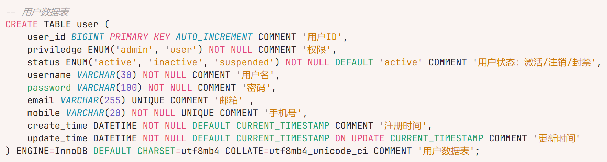

- 表`product`搞定！

  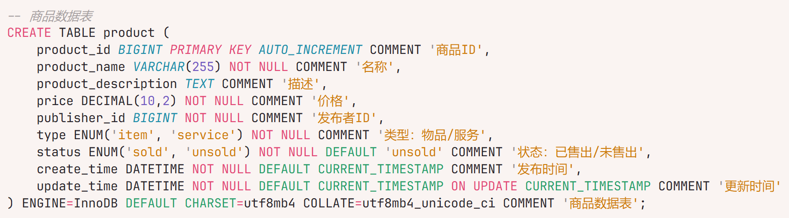

- 表`product_order`搞定！

  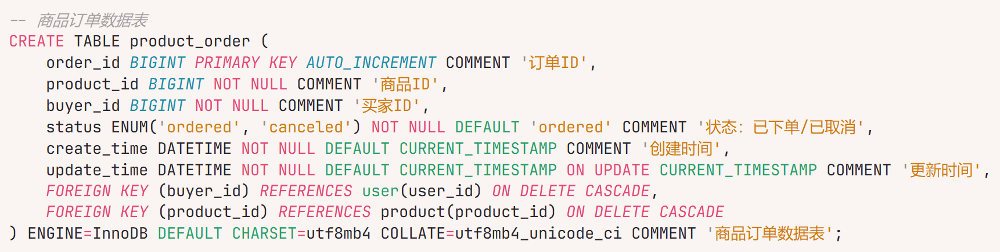

- 结果一览：

  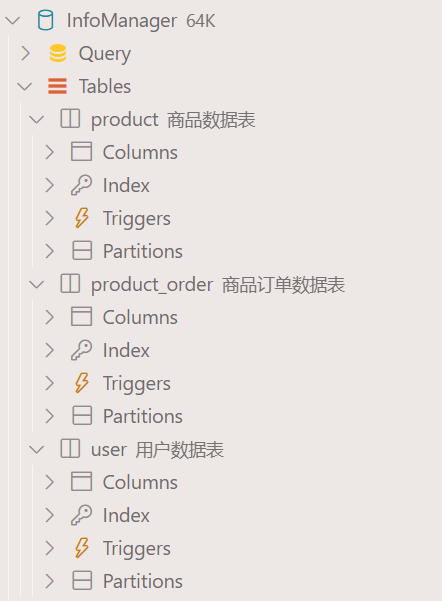

## 1.2 完蛋！我被接口包围了！

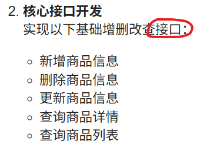

​	依旧依旧看不懂/.

- 怎样实现`Java`程序同`MySQL`数据库的互动？

  答：使用`MyBatis`

### 1.2.1 搭建接口基本框架

​	学习`MyBatis`又是一门功课，所以我们先把我们目前可以做的先做了吧✍️✍️✍️

#### 1.2.1.1 先把主界面简陋地搭建一下

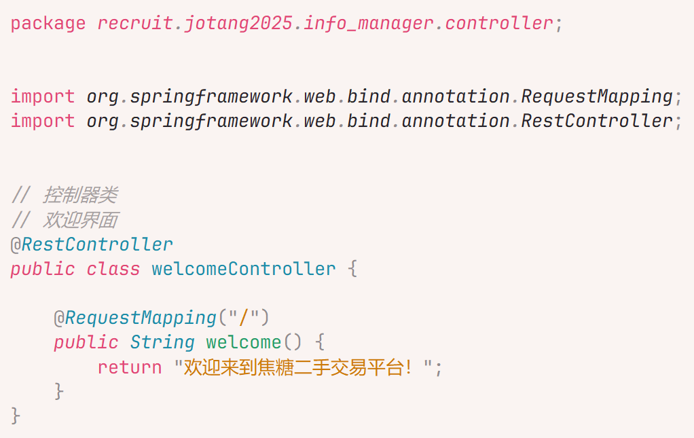

​	完工了

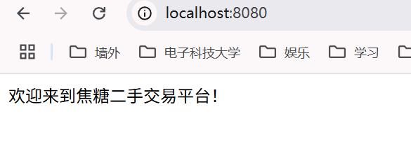

​	至少比`404 NOT FOUND`好看是不是😀😀😀

#### 1.2.1.2 将之前写的表所需要的`POJO`写一下

- 先为项目添加一个`Lombok`依赖，这样可以不用手动写`getter`和`setter`

  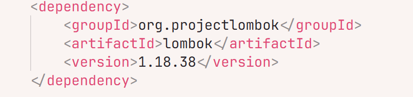

- 然后就是枯燥的搬砖时间😵‍💫😵‍💫😵‍💫

  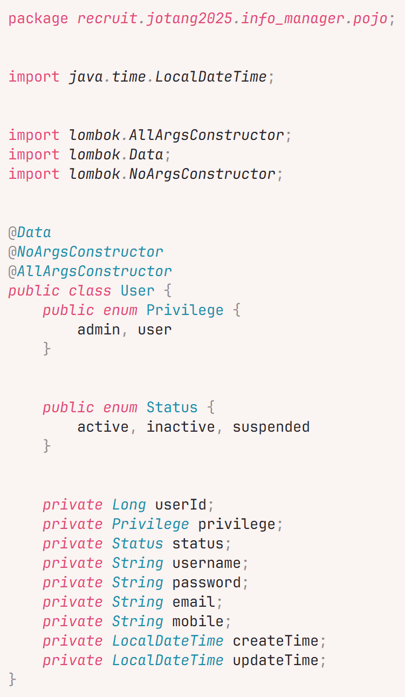

  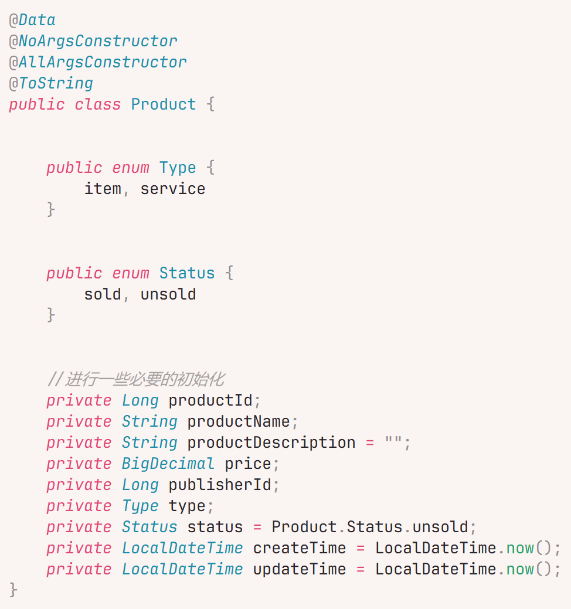

  

- 接下来我们要进入下一步了

### 1.2.2 Hello, `MyBatis`!

#### 1.2.2.1 大致理解

​	`MyBatis`就是一个工具，允许`Java`程序操作`MySQL`数据库

​	这整个过程大概是这样的：

- 用户通过网页来访问`Controller`中对应类的方法，并传递所需参数
- `Controller`再调用对应`Service`中对应类的方法，并传递所需参数
- `Service`再借由`MyBatis`的`Mapper`来操作`Repository`

#### 1.2.2.2 连接`MySQL`数据库

​	首先先在`application.properties`文件中，写一些配置，来将该项目与数据库进行连接

​	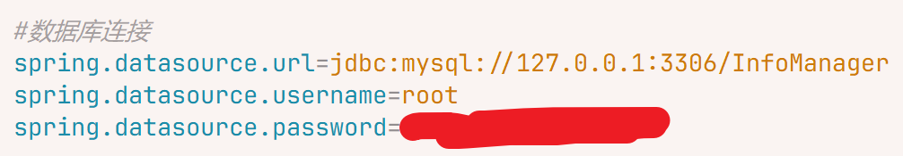

- 第一项 `url`

  `jdbc:mysql`意味着使用`JDBC`协议连接到`MySQL`数据库

  `127.0.0.1:3306`意味着`MySQL`数据库的服务器地址在本地主机的`3306`端口上

  `InfoManager`意味着想连接到的数据库的名字

- 第二项`username`和第三项`password`就都是字面意思了

#### 1.2.2.2 创建`Mapper`接口

​	先创建一个`Mapper`接口来存放操作相关的所有方法

​	

#### 1.2.2.3 使用`XML`映射来执行`SQL`语句

​	在`src/main/resources`目录下创建与`ProductMapper.java`文件**同包同名**的`ProductMapper.xml`文件

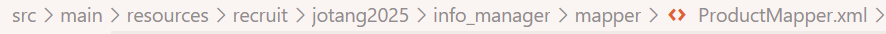

​	然后在这个`XML`文件中写好模板化的配置信息:

```xml
<?xml version="1.0" encoding="UTF-8"?>
<!DOCTYPE mapper 
    PUBLIC "-//mybatis.org//DTD Mapper 3.0//EN" 
    "http://mybatis.org/dtd/mybatis-3-mapper.dtd">
```

​	之后再注明`namespace`，也就是`ProductMapper.java`的全类名

```xml
<mapper namespace="recruit.jotang2025.info_manager.mapper.ProductMapper">
	<!-- Do Whatever You Want Below-->
    
</mapper>
```

​	然后就是写好相应的`SQL`了

```xml
<?xml version="1.0" encoding="UTF-8"?>
<!DOCTYPE mapper 
    PUBLIC "-//mybatis.org//DTD Mapper 3.0//EN" 
    "http://mybatis.org/dtd/mybatis-3-mapper.dtd">
<mapper namespace="recruit.jotang2025.info_manager.mapper.ProductMapper">

    <!-- createProduct --> 

    <!--                 
         在新增商品时，由于productId是没有确定的              
         所以，需要将useGeneratedKeys字段设置为true，并且将keyProperty字段指定为productId
         这样，数据库就会将Auto Increment的值自动赋给productId  
	-->
    <insert id="createProduct" useGeneratedKeys="true" keyProperty="productId">
        INSERT INTO product 
        (
            product_name, product_description, price, 
            publisher_id, type, status, 
            create_time, update_time
        )
        VALUES
        (
            #{productName}, #{productDescription}, #{price},
            #{publisherId}, #{type}, #{status},
            #{createTime}, #{updateTime}
        )
    </insert>

    <!-- removeProduct --> 

    <delete id="removeProduct">
        DELETE FROM product WHERE product_id = #{productId}
    </delete>

    <!-- updateProduct --> 

    <update id="updateProduct">
        UPDATE product
        SET product_name = #{productName},
            product_description = #{productDecription},
            price = #{price},
            publisher_id = #{publisherid},
            type = #{type},
            status = #{status},
            create_time = #{createTime},
            update_time = #{updateTime}
    </update>

    <!-- queryProductById --> 

    <select id="queryProductById">
        SELECT * FROM product WHERE product_id = #{productId}
    </select>

    <!-- queryAllProduct --> 

    <select id="queryAllProduct">
        SELECT * FROM product
    </select>
</mapper> 
```

#### 1.2.2.4 做好`Controller`层和`Service`层的衔接

​	`Controller`:

```java
@RestController
@RequestMapping("/product")
public class ProductController {
    @Autowired
    ProductService productService;

    //新增商品信息
    @PostMapping("/create")
    public Integer createProduct(Product product) {
        return productService.createProduct(product);
    }

    //删除商品信息
    @PostMapping("/remove")
    public Integer removeProduct(Long productId) {
        return productService.removeProduct(productId);
    }

    //更新商品信息
    @PostMapping("/update")
    public Integer updateProduct(Product product) {
        return productService.updateProduct(product);
    }

    //按Id查询商品详情
    @PostMapping("/queryById")
    public Product queryProductById(Long productId) {
        return productService.queryProductById(productId);
    }

    //查询商品列表
    @PostMapping("/queryAll")
    public List<Product> queryAllProduct() {
        return productService.queryAllProduct();
    }
}

```

​	`Service`:

```java
@Service
public class ProductService {
    @Autowired
    private ProductMapper productMapper;

    //新增商品信息
    public Integer createProduct(Product product) {
        // 如果传入空, 返回0;
        if (product == null) return 0;
        return productMapper.createProduct(product);
    }
    //删除商品信息
    public Integer removeProduct(Long productId) {
        // 如果ID对应的商品不存在, 返回0
        if(queryProductById(productId) == null) return 0;
        return productMapper.removeProduct(productId);
    }

    //更新商品信息
    public Integer updateProduct(Product product) {
        // 如果没有product对应的商品, 返回0
        if (queryProductById(product.getProductId()) == null) return 0;
        return productMapper.updateProduct(product);
    }

    //按Id查询商品详情
    public Product queryProductById(Long productId) {
        return productMapper.queryProductById(productId);
    }

    //查询商品列表
    public List<Product> queryAllProduct() {
        return productMapper.queryAllProduct();
    }
}

```

#### 1.2.2.5 写一下`Test`类

​	写一个`Test`类来简单测试一下我们刚才写的这些东西

```java
@SpringBootTest
@Transactional // 测试后数据库会进行回滚, 确保测试不会污染数据库
class ProductApplicationTests {

	@Autowired
	ProductController productController;

	Product testProduct;

	@BeforeEach // 在每个测试方法之前都运行一次, 为每个测试准备好测试数据
	public void init() {
		Long productId = 100L;
		BigDecimal price = new BigDecimal("13.14");
		Long publisherId = 1L;
		LocalDateTime now = LocalDateTime.now();
		testProduct = new Product(productId, "测试商品", "大家好啊，我是测试商品，给大家一些好看的东西",
				price, publisherId, Product.Type.item, Product.Status.unsold, now, now);
		productController.createProduct(testProduct);
	}

	// 测试的编写一般使用"AAA"规则编排, 即Arrange-Act-Assert
	@Test
	void testQueryAll() {
		// Arrange - 准备测试方法所用的数据, 这里已经准备好了

		// Act - 进行要测试的内容
		List<Product> products = productController.queryAllProduct();

		// Assert - 预测测试的结果
		assertNotNull(products, "查询结果不应为空");
		assertFalse(products.isEmpty(), "查询结果不应为空");
	}

	@Test
	void testQueryById() {
		// Arrange

		// Act
		Product foundProduct = productController.queryProductById(testProduct.getProductId());

		// Assert
		assertNotNull(foundProduct, "查询结果不应为空");
		assertEquals(foundProduct.getProductId(), testProduct.getProductId(), "ID应匹配");
		assertEquals(foundProduct.getProductName(), testProduct.getProductName(), "名字应匹配");
		assertEquals(foundProduct.getProductDescription(), testProduct.getProductDescription(), "描述应匹配");
		assertEquals(foundProduct.getPrice(), testProduct.getPrice(), "价格应匹配");
		// 懒得接着往下写了= =
	}

	@Test
	void testUpdate() {
		// Arrange
		Long newProductId = testProduct.getProductId();
		BigDecimal newPrice = new BigDecimal("5.20");
		Long newPublisherId = 2L;
		LocalDateTime now = LocalDateTime.now();
		Product newProduct = new Product(newProductId, "测试商品2号", "大家好啊，我是测试商品2号，给大家一些好看的东西",
				newPrice, newPublisherId, Product.Type.item, Product.Status.unsold, now, now);

		// Act
		Integer returnNum = productController.updateProduct(newProduct);
		Product foundProduct = productController.queryProductById(newProduct.getProductId());

		// Assert
		assertNotEquals(0, returnNum, "返回值不应为0");
		assertEquals(newProduct.getProductId(), foundProduct.getProductId(), "ID应匹配");
		assertEquals(newProduct.getPrice(), foundProduct.getPrice(), "价格应更新");
		assertEquals(newProduct.getPublisherId(), foundProduct.getPublisherId(), "发布者ID应更新");
		assertNotEquals(testProduct.getUpdateTime(), foundProduct.getUpdateTime(), "更新时间应更新");
	}

	@Test
	void testDelete() {
		// Arrange
		Long toBeDeletedId = testProduct.getProductId();

		// Act
		Integer returnNum = productController.removeProduct(toBeDeletedId);
		Product foundProduct = productController.queryProductById(toBeDeletedId);

		// Assert
		assertEquals(1, returnNum, "返回值应为1");
		assertEquals(null, foundProduct, "查询结果应为空");
	}
}

```

​	成功了！

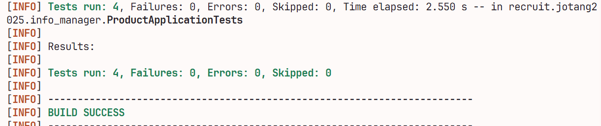

## 1.3 It's a bird, it's a plane……It's `POSTMAN`！

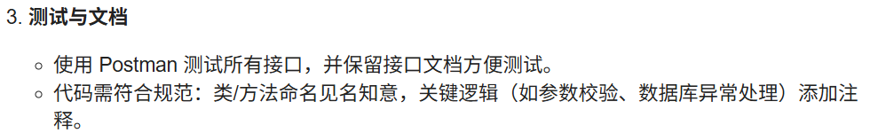

### 1.3.1 什么是`POSTMAN`?

​	`POSTMAN`就是一个可以自定义`HTTP`方法、请求头、请求体来访问特定网址，并且接收到网页返回的信息，以此来进行网页测试的工具

### 1.3.2 开始写测试！

​	根据我们`ProductController`中的方法，开始一一撰写对应的测试：

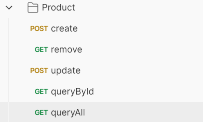

### 1.3.3 发现问题😱😱😱

​	在进行`create`、`update`、`delete`的测试之后，忽然发现一个十分致命的问题：

​	在调用`queryAll`来查看数据库内容的时候出现了这个

```json
[
    {
        "productId": 1,
        "productName": "测试商品",
        "productDescription": "快来买，快来买，快来买",
        "price": 13.14,
        "publisherId": 1,
        "type": "item",
        "status": "unsold",
        "createTime": "2025-09-24T11:33:57",
        "updateTime": "2025-09-24T11:35:16"
    },
    {
        "productId": 2,
        "productName": "测试商品",
        "productDescription": "快来买，快来买，快来买",
        "price": 13.14,
        "publisherId": 1,
        "type": "item",
        "status": "unsold",
        "createTime": "2025-09-24T11:33:57",
        "updateTime": "2025-09-24T11:35:16"
    },
    {
        "productId": 3,
        "productName": "测试商品",
        "productDescription": "快来买，快来买，快来买",
        "price": 13.14,
        "publisherId": 1,
        "type": "item",
        "status": "unsold",
        "createTime": "2025-09-24T11:33:57",
        "updateTime": "2025-09-24T11:35:16"
    }
]
```

我数据库中所有的数据都变成了测试数据了😭😭😭

之前跑`Test`类时没有发现，是因为使用了`Transactional`进行了回滚，现在毛病就暴露出来了

光速修改`SQL`语句

```xml
    <update id="updateProduct">
        UPDATE product
        SET product_name = #{productName},
            product_description = #{productDescription},
            price = #{price},
            publisher_id = #{publisherId},
            type = #{type},
            status = #{status},
            create_time = #{createTime},
            update_time = #{updateTime}
        WHERE product_id = #{productId} <!-- 👈少了这句，要了命了😭😭😭 -->
    </update>
```

然后再恢复一下原来的数据...

再进行`queryAll`...

成功！

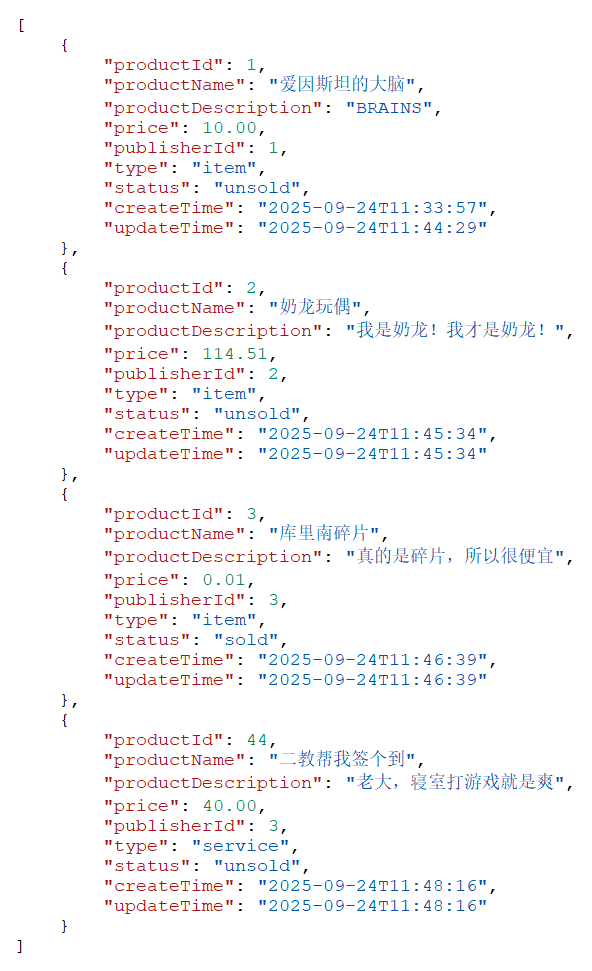

### 1.3.4 创作我们的`API Documentation`

把相关代码丢给`Gemini`，一下子就有了🤓🤓🤓

```yaml
# ProdutctController
openapi: '3.0.0'
info:
  version: '1.0.0'
  title: 'Product Information Management API'
  description: API for managing product data, including creation, retrieval, update, and deletion.

paths:
  # 1. 新增商品信息 (POST /product/create)
  /product/create:
    post:
      summary: Create a new product
      operationId: createProduct
      requestBody:
        description: Product object to be created
        required: true
        content:
          application/json:
            schema:
              $ref: '#/components/schemas/ProductInput'
      responses:
        '200':
          description: Product created successfully, returns the number of rows affected (usually 1)
          content:
            application/json:
              schema:
                type: integer
                format: int32
                example: 1
        '500':
          description: Internal server error
          content:
            application/json:
              schema:
                $ref: '#/components/schemas/Error'

  # 2. 删除商品信息 (GET /product/remove)
  /product/remove:
    get: 
      summary: Remove a product by ID
      operationId: removeProduct
      parameters:
        - name: id
          in: query 
          description: The unique identifier (productId) of the product to be removed
          required: true
          schema:
            $ref: '#/components/schemas/ProductId'
      responses:
        '200':
          description: Product removed successfully, returns the number of rows affected (usually 1)
          content:
            application/json:
              schema:
                type: integer
                format: int32
                example: 1
        '404':
          description: No product found for the provided ID
        '500':
          description: Internal server error

  # 3. 更新商品信息 (POST /product/update)
  /product/update:
    post:
      summary: Update an existing product
      operationId: updateProduct
      requestBody:
        description: Product object with updated fields. productId must be present.
        required: true
        content:
          application/json:
            schema:
              $ref: '#/components/schemas/ProductInput'
      responses:
        '200':
          description: Product updated successfully, returns the number of rows affected (usually 1)
          content:
            application/json:
              schema:
                type: integer
                format: int32
                example: 1
        '404':
          description: Product ID not found or could not be updated
        '500':
          description: Internal server error

  # 4. 按Id查询商品详情 (GET /product/queryById)
  /product/queryById:
    get:
      summary: Query product details by ID
      operationId: queryProductById
      parameters:
        - name: id
          in: query 
          description: The unique identifier (productId) of the product
          required: true
          schema:
            $ref: '#/components/schemas/ProductId'
      responses:
        '200':
          description: Successfully returned the product details
          content:
            application/json:
              schema:
                $ref: '#/components/schemas/ProductOutput' 
        '404':
          description: No product found for the provided ID
        '500':
          description: Internal server error

  # 5. 查询商品列表 (GET /product/queryAll)
  /product/queryAll:
    get:
      summary: Query all products
      operationId: queryAllProduct
      responses:
        '200':
          description: Successfully returned the list of all products
          content:
            application/json:
              schema:
                type: array
                items:
                  $ref: '#/components/schemas/ProductOutput'
        '500':
          description: Internal server error

components:
  schemas:
    ProductId: 
      description: The unique identifier of a product
      type: integer
      format: int64

    ProductType: 
      type: string
      enum:
        - item
        - service

    ProductStatus: 
      type: string
      enum:
        - sold
        - unsold

    ProductInput: 
      type: object
      required:
        - productName
        - price
        - publisherId
        - type
      properties:
        productId: 
          $ref: '#/components/schemas/ProductId'
        productName:
          type: string
          description: 商品名称
          maxLength: 255
        productDescription:
          type: string
          description: 商品描述
        price:
          type: number
          format: double
          description: 价格 (decimal(10, 2))
        publisherId:
          type: integer
          format: int64
          description: 发布者ID
        type:
          $ref: '#/components/schemas/ProductType'
        status:
          $ref: '#/components/schemas/ProductStatus'

    ProductOutput: 
      type: object
      required:
        - productId
        - productName
        - price
        - publisherId
        - type
        - status
        - createTime
        - updateTime
      properties:
        productId:
          $ref: '#/components/schemas/ProductId'
        productName:
          type: string
        productDescription:
          type: string
        price:
          type: number
          format: double
        publisherId:
          type: integer
          format: int64
        type:
          $ref: '#/components/schemas/ProductType'
        status:
          $ref: '#/components/schemas/ProductStatus'
        createTime:
          type: string
          format: date-time
        updateTime:
          type: string
          format: date-time
        
    Error: 
      type: object
      required:
        - message
      properties:
        message:
          description: A human readable error message
          type: string

  securitySchemes: 
    ApiKey:
      type: apiKey
      in: header
      name: X-Api-Key

security: 
  - ApiKey: []
```


## 1.4 有待改进的地方

​	~~之所以没完成是担心时间不够~~

​	~~所以在所有事情都完事之后，可能会来填坑~~

### 1.4.1 有利于健壮性的一些改动...(已完成)

- `Service`层应该加入一些对输入参数正确性的验证

  比如一些参数为`null`时，应当给予一些提示

- 应当再加上一些异常处理机制

  比如当查询ID不存在时，应当返回一些文字提示

### 1.4.2 使用`Spring Cache` + `Redis`

- 对，又是我看不懂的专有名词
- 又得花好久才能玩上😵‍💫😵‍💫😵‍💫
