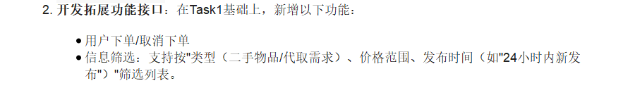
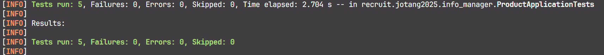
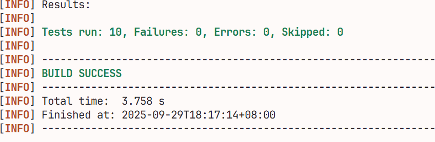

# Task2的笔记在这里

## 2.1 回答一些问题！


- **一对多**

  指一个**父实体**可以对应多个**子实体**，但是一个子实体只能对应一个父实体

  `用户`与`商品下单`对应**一对多**的关系

  因为一个用户可以有多个商品订单，但是一个商品订单只对应一个用户

- **多对多**

  指一个实体A可以对应多个实体B，同时一个实体B也可以对应多个实体A

  `用户`与`商品收藏`对应**多对多**的关系

  因为一个用户可以收藏多个商品，同时一个商品也可以被多个用户收藏

## 2.2 什么上单中单？我只玩下单🤓🤓🤓



​	因为出题人的**怜悯**，我不需要处理**商品收藏**这种多对多的恼人玩意儿😭😭😭

​	既然是一对多的关系，拿`FOREIGN KEY`应该就可以处理了

​	*\*在看了一集视频后\**

​	但是**话又说回来了**，`FOREIGN KEY`有很多的局限，那我们还是老老实实在代码层面解决关联问题吧😵‍💫😵‍💫😵‍💫

### 2.2.1 一些规划...

- 首先要完成`ProductOrder`的`CRUD`，这样才可以实现下单/取消订单
  - ~~增删改操作均为**管理员权限**的操作~~ 还不会登录先忽略 
- 下单`placeOrder`时，
  - 调用`createOrder`前，确保关联的商品的`status`在下单前是`unsold`，并且下单后更新为`sold`
  - 在下单时，订单的`status`的缺省值是`ordered`
- 取消订单`cancelOrder`时，
  - 检查订单是否存在
  - ~~检查订单取消者是否是订单的发布者~~ 还不会登录先忽略
  - 检查订单的`status`必须是`ordered`，如果是则将其改为`canceled`
  - 将关联商品的`status`从`sold`改为`unsold`
- 筛选信息`queryByFilter`时，
  - 支持按照`productOrder`的 `type`、`price` 、`createTime`来进行查询
  
- 在编写`Controller`层时，
  - 使用`全局异常处理器`进行异常处理
  - 使用`ResponseEntity`作为方法的返回类型，从而实现更标准的响应

- 在编写`Service`层时，
  - 在恰当时候抛出异常


### 2.2.2 先把`Controller`搞定！

​	有了Task1的经验，简直是易如反掌（并不）

```java
@RestController
@RequestMapping("/order")
public class ProductOrderController {
    @Autowired
    private ProductOrderService productOrderService;

    // 创建订单
    @PostMapping("/create")
    public ResponseEntity<ProductOrder> createOrder(@RequestBody ProductOrder order) {
        productOrderService.createOrder(order);
        return ResponseEntity.status(HttpStatus.CREATED).body(order);
    }

    // 删除订单
    @DeleteMapping("/remove")
    public ResponseEntity<String> removeOrder(@RequestParam("id") Long orderId) {
        productOrderService.removeOrder(orderId);
        return ResponseEntity.ok("订单" + orderId + "删除成功！");
    }

    // 更新订单
    @PostMapping("/update")
    public ResponseEntity<ProductOrder> updateOrder(@RequestBody ProductOrder order) {
        productOrderService.updateOrder(order);
        return ResponseEntity.ok(order);
    }

    // 按ID查询订单
    @GetMapping("/queryById")
    public ResponseEntity<ProductOrder> queryOrderById(@RequestParam("id") Long orderId) {
        ProductOrder founOrder = productOrderService.queryOrderById(orderId);
        return ResponseEntity.ok(founOrder);
    }

    // 下单
    @PostMapping("/placeOrder")
    public ResponseEntity<ProductOrder> placeOrder(@RequestBody ProductOrder order) {
        productOrderService.placeOrder(order);
        return ResponseEntity.ok(order);
    }

    // 取消订单
    @DeleteMapping("/cancelOrder")
    public ResponseEntity<String> cancelOrder(@RequestParam("id") Long orderId) {
        productOrderService.cancelOrder(orderId);
        return ResponseEntity.ok("订单" + orderId + "取消成功！");
    }
}
```

- 类`ResponseEntity`是用于包装返回实体的类型，

### 2.2.3 `Service`和`异常处理`不得不说的故事😍😍😍

​	在`Service`层通常进行异常的`throw`，这就涉及了异常处理方面

#### 2.2.3.1 有关异常处理的一些碎碎念...

​	为了避免`Controller`层大量臃肿的`try-catch`语句，我会使用`异常处理器`来处理`Service`层产生的异常

​	也就是说，在`Service`层中我会扔出许多异常，但是这些异常不会在`Controller`层被`try-catch`捕获，而是继续上浮，被专门的`Handler`抓到

​	这些`Handler`会负责好异常出现时，用户接收到怎样的返回代码和错误信息

​	除此之外，我也需要自定义好一些异常类，这样能够更好地反映出出现的异常情况

#### 2.2.3.2 先写好`Service`!

​	~~我们必须想象西西弗斯是快乐的~~

```java
@Service
public class ProductOrderService {
    @Autowired
    private ProductOrderMapper productOrderMapper;
    @Autowired
    private ProductMapper productMapper;

    // 创建订单
    public Integer createOrder(ProductOrder order) {
        return productOrderMapper.createOrder(order);
    }

    // 删除订单
    public Integer removeOrder(Long orderId) {
        return productOrderMapper.removeOrder(orderId);
    }

    // 更新订单
    public Integer updateOrder(ProductOrder order) {
        return productOrderMapper.updateOrder(order);
    }

    // 按ID查询订单
    public ProductOrder queryOrderById(Long orderId) {
        ProductOrder newOrder = productOrderMapper.queryOrderById(orderId);
        // 未查询到订单
        if (newOrder == null) {
            throw new OrderNotFoundException(orderId);
        }
        return newOrder;
    }

    // 下单
    @Transactional // 确保在操作数据库时要么全成功要么全失败 不会出现订单表更新失败，但是商品表更新成功的情况
    public Integer placeOrder(ProductOrder order) {
        ProductOrder newOrder = order;
        // 订单不存在
        if (newOrder == null) {
            throw new OrderNotFoundException("目标订单不存在");
        }

        Product relatedProduct = productMapper.queryProductById(newOrder.getProductId());
        // 对应商品不存在
        if (relatedProduct == null) {
            throw new ProductNotFoundException("订单对应的商品不存在");
        }
        // 商品已售出
        if (relatedProduct.getStatus() != Product.Status.unsold) {
            throw new IllegalOperationException("商品已售出");
        }
        // 设置状态
        relatedProduct.setStatus(Product.Status.sold);
        newOrder.setStatus(ProductOrder.Status.ordered);
        // 创建订单&更新商品信息
        productMapper.updateProduct(relatedProduct);
        return createOrder(newOrder);
    }

    // 取消订单
    @Transactional
    public Integer cancelOrder(Long orderId) {
        ProductOrder foundOrder = queryOrderById(orderId);

        // 订单已取消
        if (foundOrder.getStatus() != ProductOrder.Status.ordered) {
            throw new IllegalOperationException("无法重复取消订单");
        }

        Product foundProduct = productMapper.queryProductById(foundOrder.getProductId());
        // 商品不存在
        if (foundProduct == null) {
            throw new ProductNotFoundException("订单对应的商品不存在");
        }

        // 设置状态
        foundProduct.setStatus(Product.Status.unsold);
        foundOrder.setStatus(ProductOrder.Status.canceled);
        // 更新状态
        productMapper.updateProduct(foundProduct);
        return updateOrder(foundOrder);

    }

}
```

​	也有一些值得说两下的点

- `@Transactional`会让其标注的方法被视作一个**事务**，从而避免在操作数据库时出现类似订单信息更新失败了，但是商品信息却依然更新成功这样“干活干一半”的情况

- `throw new xxxException("xxx")`就是扔出异常的语句

  

#### 2.2.3.3 自定义异常类

```java
public class IllegalOperationException extends RuntimeException{
    public IllegalOperationException(String message) {
        super(message);
    }
}

public class OrderNotFoundException extends RuntimeException {
    public OrderNotFoundException(Long orderId) {
        super("未找到订单ID:" + orderId);
    }

    public OrderNotFoundException(String message) {
        super(message);
    }
}

public class ProductNotFoundException extends RuntimeException {
    public ProductNotFoundException(Long productId) {
        super("未找到商品ID:" + productId);
    }

    public ProductNotFoundException(String message) {
        super(message);
    }
}

```

- 关键字`extends`标明我的自定义异常类**继承**自`Java`的`RuntimeException`异常类，换言之就是拥有了其非私有的全部特性
- 关键字`super`相当于一个代词，指代这个类所继承的父类，相当于是`this`的*世界上另一个我*

#### 2.2.3.4 异常处理器

​	一般来说需要两种异常处理器：一种处理可预见的异常，负责日常使用；另一种处理不可预见的异常，负责紧急兜底

```java
// 日常使用的异常处理器
@RestControllerAdvice(assignableTypes=ProductOrderController.class)
public class ProductOrderExceptionHandler {

    // 订单不存在异常
    @ExceptionHandler(OrderNotFoundException.class)
    public ResponseEntity<String> handleOrderNotFoundException(OrderNotFoundException e) {
        return ResponseEntity.status(HttpStatus.NOT_FOUND).body("404 Not Found:" + e.getMessage());
    }

    // 商品不存在异常
    @ExceptionHandler(ProductNotFoundException.class)
    public ResponseEntity<String> handleProductNotFoundException(ProductNotFoundException e) {
        return ResponseEntity.status(HttpStatus.NOT_FOUND).body("404 Not Found:" + e.getMessage());
    }

    // 非法访问异常
    @ExceptionHandler(IllegalOperationException.class)
    public ResponseEntity<String> handleIllegalOperationException(IllegalOperationException e) {
        return ResponseEntity.status(HttpStatus.BAD_REQUEST).body("400 Bad Request:" + e.getMessage());
    }

    // 非法参数异常
    @ExceptionHandler(IllegalArgumentException.class)
    public ResponseEntity<String> handleIllegalArgumentException(IllegalArgumentException e) {
        return ResponseEntity.status(HttpStatus.BAD_REQUEST).body("400 Bad Request:" + e.getMessage());
    }
}

```

- 注解`@RestControllerAdvice`中的参数标明了这个异常处理器的负责哪些代码的异常处理
- 注解`@ExceptionHandler`标明了对应的方法处理的是哪种异常情况
- 类`ResponseEntity`标明了对应的处理方法的返回信息，包括状态码`status`和返回体`body`

```java
// 极限兜底的异常处理器
@RestControllerAdvice
public class GlobalFallbackExceptionHandler {

    // 兜底运行时错误
    @ExceptionHandler(RuntimeException.class)
    public ResponseEntity<String> handleGeneralRuntimeException(RuntimeException e) {
        return ResponseEntity.status(HttpStatus.INTERNAL_SERVER_ERROR).body("运行时未知错误！");
    }

    // 兜底除此之外未知的其他所有错误
    @ExceptionHandler(Exception.class)
    public ResponseEntity<String> handleGeneralOtherException(Exception e) {
        return ResponseEntity.status(HttpStatus.INTERNAL_SERVER_ERROR).body("未知错误！");
    }
}

```

- 注解`@RestControllerAdvice`没有参数，标明负责所有代码的异常处理，也就是*兜底*
- 注解`@ExceptionHandler`中是`RuntimeException.class`和`Exception.class`这两个父类，标明这些方法会处理那些出现了的莫名其妙的异常

### 2.2.4 回到`MyBatis`

​	`Java`部分的代码写的差不多了

​	该重新回到与`MySQL`的交互之中了

#### 2.2.4.1动态`SQL`标签

​	由于筛选的条件是不固定的，所以相应的`SELECT`语句也需要*动态*变化

​	幸好，`MyBatis`相关的`Mapper.xml`中支持许多动态`SQL`标签，让`SQL`语句可以*审时度势*

```xml
<!-- <if> -->
<!-- 若test为真，则执行SQLS，否则就忽略 -->
<if test="<some_expressions>">
    SQLs
</if>

<!-- <where> -->
<!-- 更加智能的WHERE，总之在复杂情况下用这个标签代替WHERE就对了 -->
<where>
	SQLs
</where>

<!-- <set> -->
<!-- 更加智能的SET，总之在复杂情况下用这个标签代替SET就对了 -->
<set>
    SQLs
</set>

<!-- <choose>/<when>/<otherwise> -->
<!-- switch/case/default的同分异构体，不多解释 -->
<choose>
    <when test="expression">
        SQLs
    </when>
    <when test="another_expression">
        SQLs
    </when>
    <otherwise>
        SQLs
    </otherwise>
</choose>

<!-- <sql>和<include> -->
<!-- <sql>标明那些需要复用的SQL，<include>使用那些需要复用的SQL -->
<sql id="aCuteName">
	IMPORTANT_SQLs
</sql>

<include refid="aCuteName"> <!-- 等价于IMPORTANT_SQLs -->
    
<!-- <foreach> -->
<!-- 遍历给定集合中的元素，将这些元素逐个拼接到一起，经常跟IN搭配，实现对集合数据中的操作 -->
<!-- 一个例子 -->
<select id="findUsersByIds" resultType="User">
	SELECT * FROM user
	WHERE id IN
	<foreach collection="ids" item="userId" open="(" separator="," close=")">
    	#{userId}
	</foreach>
</select>
<!-- 如果给定的集合ids = {1, 2, 3}是，那么以上的SQLs等价于
	 SELECT * FROM user WHERE id IN (1, 2, 3) 	      -->
```

​	在这里的筛选，我们主要用到的就是`<if>`和`<where>`了

​	~~在这里突然意识到筛选查询商品应该放在`Product`模块而非`ProductOrder`模块~~

​	~~于是匆匆忙忙把之前的`Controller`,`Service`~~

#### 2.2.4.2 上实操🤓🤓🤓

​	`ProductOrder`的`CRUD`操作就不再赘述了，这里直接进入到商品的信息筛选部分

```xml
    <!-- queryProductByFilters --> 

    <select id="queryProductByFilters">
        SELECT * FROM product
        <where>
            <if test="type != null">
                AND type = #{type}
            </if>

            <if test="minPrice != null">
                AND price >= #{minPrice}
            </if>

            <if test="maxPrice != null">
                AND price <= #{maxPrice}
            </if>

            <if test="startTime != null">
                AND update_time > #{startTime}
            </if>

        </where>
        ORDER BY update_time DESC

    </select>
```

### 2.2.5 EEEEEROR😵‍💫😵‍💫😵‍💫

#### 2.2.5.1 `Product`模块

​	写一下对应的测试类

```java
@Test
	void testQueryByFilters() {
		// Arrange
		BigDecimal smallPrice = new BigDecimal("5.00");
		BigDecimal bigPrice = new BigDecimal("50.00");
		LocalDateTime startDateTime = LocalDateTime.now().minusDays(1);

		// Act 
		// 什么都不筛选 
		ResponseEntity<List<Product>> noFilter = productController.queryProductByFilters(null, null, null, null);
		List<Product> allProducts = noFilter.getBody();

		// type的筛选
		ResponseEntity<List<Product>> typeFilter = productController.queryProductByFilters("item", null, null, null);
		List<Product> typeProducts = typeFilter.getBody();

		// minPrice的筛选
		ResponseEntity<List<Product>> minPriceFilter = productController.queryProductByFilters(null, smallPrice, null, null);
		List<Product> minPriceProducts = minPriceFilter.getBody();

		// maxPrice的筛选
		ResponseEntity<List<Product>> maxPriceFilter = productController.queryProductByFilters(null, null, bigPrice, null);
		List<Product> maxPriceProducts = maxPriceFilter.getBody();

		// minPrice和maxPrice的筛选
		ResponseEntity<List<Product>> betweenPriceFilter = productController.queryProductByFilters(null, smallPrice, bigPrice, null);
		List<Product> betweenPriceProducts = betweenPriceFilter.getBody();

		// startTime的筛选
		ResponseEntity<List<Product>> startTimeFilter = productController.queryProductByFilters(null, null, null, startDateTime);
		List<Product> startTimeProducts = startTimeFilter.getBody();

		// Assert
		assertEquals(5, allProducts.size(), "无条件: 一共应有5个元素");
		assertEquals(4, typeProducts.size(), "type: 一共应有4个元素");
		assertEquals(4, minPriceProducts.size(), "minPrice: 一共应有4个元素");
		assertEquals(4, maxPriceProducts.size(), "maxPrice: 一共应有4个元素");
		assertEquals(3, betweenPriceProducts.size(), "betweenPrice: 一共应有3个元素");
		assertEquals(1, startTimeProducts.size(), "startTime: 一共应有1个元素");
	}
```


- 运行了`mvn test`后全线标红，测试类全部ERORR

  拿log问了一下GPT，得知原因出在`XML`文件编写`SQL`时，比较运算符`<`和`>`没有使用**转义字符**

  也就是说`<`和`>`要分别换成`&lt;`和`&gt;`才可以

- 在修改完成后，重新运行`mvn test`，结果还是全部ERROR

  自己看了一下log，得知原因是在调用`INSERT INTO`时，`create_time`不能为null

  问了一下GPT，得知只有当在`INSERT INTO`中没有显式标明数据时，`DEFAULT`才会生效

  所以需要重新修改一下`XML`文件中的`SQL`，删去相关部分

- 修改再次运行`mvn test`后，只爆出两个ERROR了

  ```bash
  ProductApplicationTests.testDelete:102 » ProductNotFound 未找到商品ID:48
  ProductApplicationTests.testUpdate:83 » DataIntegrityViolation 
  ```

  感谢`Spring Boot`为我定位🙏🙏🙏

  那还说啥了，debug就完了呗

- 稍作修改之后，ERROR清除了✌✌✌

  只有一些`Faliures`

  ```bash
  [ERROR] Failures: 
  [ERROR]   ProductApplicationTests.testDelete:110 删除不存在的商品时报错 ==>   Unexpected exception type thrown, expected:   <recruit.jotang2025.info_manager.exception.IllegalOperationException> but was: <recruit.jotang2025.info_manager.exception.ProductNotFoundException>
  [ERROR]   ProductApplicationTests.testUpdate:92 传入空指针时报错 ==> Unexpected exception type thrown, expected: <java.lang.IllegalArgumentException> but was: <java.lang.NullPointerException>
  ```

​	稍作修改就能搞定

- 成功！

  

#### 2.2.5.2 `ProductOrder`模块

​	~~写测试类的时候才发现，两个模块的相同功能我写的逻辑都不一样，果然干活之前还是得谋定而后动，要把规划文档好好写才行~~

  ```java
@SpringBootTest
@Transactional
public class ProductOrderApplicationTests {

    @Autowired
    ProductOrderController orderController;
    @Autowired
    ProductController productController;

    ProductOrder testOrder;

    @BeforeEach
    public void init() {
        Long productId = 1L;
        Long buyerId = 1L;
        testOrder = new ProductOrder(
                null,
                productId,
                buyerId,
                null,
                null,
                null);
    }

    @Test
    void testRemove() {
        orderController.createOrder(testOrder);
        Long toBeDeletedId = testOrder.getOrderId();

        orderController.removeOrder(toBeDeletedId);

        assertThrowsExactly(OrderNotFoundException.class,
                () -> orderController.queryOrderById(toBeDeletedId),
                "查询到已删除的订单时应报错");
    }

    @Test
    void testUpdate() {
        orderController.createOrder(testOrder);
        ProductOrder newOrder = new ProductOrder(
                testOrder.getOrderId(), testOrder.getProductId(), testOrder.getBuyerId(),
                testOrder.getStatus(),
                testOrder.getCreateTime(), testOrder.getUpdateTime().plusDays(1));
        ProductOrder foundOrder;

        orderController.updateOrder(newOrder);
        foundOrder = orderController.queryOrderById(newOrder.getOrderId()).getBody();

        assertNotEquals(foundOrder.getUpdateTime(), testOrder.getUpdateTime(), "更新时间应已更新");

    }

    @Test
    void testQueryById() {
        orderController.createOrder(testOrder);
        ProductOrder foundOrder;

        foundOrder = orderController.queryOrderById(testOrder.getOrderId()).getBody();

        assertNotNull(foundOrder, "查询结果不应为空");
        assertEquals(testOrder, foundOrder, "查询结果应相同");
        assertThrowsExactly(OrderNotFoundException.class,
                () -> orderController.queryOrderById(666666L),
                "查询不存在的订单时应报错");
    }

    @Test
    void testPlace() {
        // Arrange
        Product testProduct = new Product(
                null,
                "测试商品",
                "大家好啊，我是测试商品，给大家一些好看的东西",
                BigDecimal.TEN,
                1L,
                Product.Type.item,
                null,
                null,
                null);
        Product.Status beforeStatus;
        Product.Status afterStatus;

        ProductOrder foundOrder;
        ProductOrder productNotFoundOrder;
        ProductOrder productSoldOrder;

        // Act
        beforeStatus = testProduct.getStatus();

        productController.createProduct(testProduct);

        testOrder.setBuyerId(2L);
        testOrder.setProductId(testProduct.getProductId());

        orderController.placeOrder(testOrder);

        afterStatus = testProduct.getStatus();
        foundOrder = orderController.queryOrderById(testOrder.getOrderId()).getBody();

        productNotFoundOrder = orderController.queryOrderById(testOrder.getOrderId()).getBody();
        productNotFoundOrder.setProductId(666666L);
        productSoldOrder = orderController.queryOrderById(testOrder.getOrderId()).getBody();
        productSoldOrder.setProductId(3L);

        // Assert
        assertNotEquals(afterStatus, beforeStatus, "相关商品状态应已修改");
        assertNotNull(foundOrder, "成功插入了订单");
        assertEquals(ProductOrder.Status.ordered, foundOrder.getStatus(), "订单初始状态应为Ordered");

        assertThrowsExactly(
                OrderNotFoundException.class,
                () -> orderController.placeOrder(null),
                "传入空订单时报错");
        assertThrowsExactly(
                ProductNotFoundException.class,
                () -> orderController.placeOrder(productNotFoundOrder),
                "订单无对应商品时应该报错");
        assertThrowsExactly(
                IllegalOperationException.class,
                () -> orderController.placeOrder(productSoldOrder),
                "相关的商品已售出时应报错");
    }

    @Test
    void testCancel() {
        // Arrange
        ProductOrder foundOrder;
        ProductOrder productNotFoundOrder;
        Product testProduct = new Product(
                null,
                "测试商品",
                "大家好啊，我是测试商品，给大家一些好看的东西",
                BigDecimal.TEN,
                1L,
                Product.Type.item,
                null,
                null,
                null);
        Product.Status beforeProductStatus;
        Product.Status afterProductStatus;
        ProductOrder.Status beforeOrderStatus;
        ProductOrder.Status afterOrderStatus;

        // Act
        productController.createProduct(testProduct);

        testOrder.setBuyerId(2L);
        testOrder.setProductId(testProduct.getProductId());

        orderController.placeOrder(testOrder);

        beforeOrderStatus = testOrder.getStatus();
        beforeProductStatus = testProduct.getStatus();

        orderController.cancelOrder(testOrder.getOrderId());

        foundOrder = orderController.queryOrderById(testOrder.getOrderId()).getBody();
        afterOrderStatus = foundOrder.getStatus();
        afterProductStatus = testProduct.getStatus();

        // Assert
        assertNotEquals(beforeProductStatus, afterProductStatus, "商品状态应更新");
        assertNotEquals(beforeOrderStatus, afterOrderStatus, "订单状态应更新");
        assertEquals(ProductOrder.Status.canceled, afterOrderStatus, "订单状态应为canceled");
        assertThrowsExactly(
                IllegalOperationException.class,
                () -> orderController.cancelOrder(testOrder.getOrderId()),
                "重复取消订单时应报错");
    }
}
  ```

​	让`mvn test`跑起来...

- 不出所料第一次就失败了💀💀💀

  所幸报错信息还是很友好的

  ```bash
  [ERROR]   ProductOrderApplicationTests.testCancel:172 » BadSqlGrammar 
  ### Error updating database.  Cause: java.sql.SQLSyntaxErrorException: You have an error in your SQL syntax; check the manual that corresponds to your MySQL server version for the right syntax to use near ') 
          VALUE 
          (
              81,
              2,
          )' at line 5
  ### The error may exist in recruit/jotang2025/info_manager/mapper/ProductOrderMapper.xml
  ```

  发现是`XML`里面`SQL`语法的问题，速修！
  
  修好之后让我们在跑一次...
  
- 第二次好了一些，但还是有问题

  ```bash
  [ERROR] Failures: 
  [ERROR]   ProductOrderApplicationTests.testPlace:128 相关商品状态应已修改 ==> expected: not equal but was: <null>
  [ERROR]   ProductOrderApplicationTests.testQueryById:83 查询结果应相同 ==> expected: <ProductOrder(orderId=5, productId=1, buyerId=1, status=null, createTime=null, updateTime=null)> but was: <ProductOrder(orderId=5, productId=1, buyerId=1, status=ordered, createTime=2025-09-29T14:57:21, updateTime=2025-09-29T14:57:21)>
  [ERROR] Errors: 
  [ERROR]   ProductOrderApplicationTests.testCancel:177 » MyBatisSystem
  [ERROR]   ProductOrderApplicationTests.testUpdate:65 NullPointer Cannot invoke "java.time.LocalDateTime.plusDays(long)" because the return value of "recruit.jotang2025.info_manager.pojo.ProductOrder.getUpdateTime()" is null
  [INFO] 
  [ERROR] Tests run: 10, Failures: 2, Errors: 2, Skipped: 0
  ```

  先解决ERROR

  - 发现是在测试类的`setup()`方法中，没有初始化`ProductOrder`的`createTime`和`updateTime`导致的

    然后一通学习之后发现，在DB中设置了`DEFAULT`的字段，在使用默认值的时候并不会自动把默认值返回到`POJO`对应的属性中

    所以还是老老实实地初始化吧

- 第三次没有了ERROR，只剩了FAILURES

  ```bash
  [ERROR] Failures: 
  [ERROR]   ProductOrderApplicationTests.testCancel:185 商品状态应更新 ==> expected: not equal but was: <unsold>
  [ERROR]   ProductOrderApplicationTests.testPlace:129 相关商品状态应已修改 ==> expected: not equal but was: <unsold>
  [ERROR]   ProductOrderApplicationTests.testQueryById:84 查询结果应相同 ==> expected: <ProductOrder(orderId=25, productId=1, buyerId=1, status=ordered, createTime=2025-09-29T15:34:45.550161314, updateTime=2025-09-29T15:34:45.550173447)> but was: <ProductOrder(orderId=25, productId=1, buyerId=1, status=ordered, createTime=2025-09-29T15:34:45, updateTime=2025-09-29T15:34:45)>
  ```

  能咋办呢😵‍💫😵‍💫😵‍💫挨个查吧那就

  - `Line:84`的是最简单的，是因为`MySQL`的`DateTime`和`Java`中`LocalDateTime`格式不同，不算错误

    在测试类中取消对这两个变量的判定即可

  - `Line:185`和`Line:129`是一个问题，都是商品状态未修改

    对于`testCancel`，我验证了订单取消后对应的商品状态应为正确的`unsold`，发现没有报错

    对于`testPlace`，我验证了下下单后对应的商品状态应为正确的`sold`，发现报错了

    这说明这两个错误的来源是`placeOrder`并没有正确地修改商品状态信息

    但是经过又一番调查发现，并不是没有修改商品状态信息，而是修改后的信息没有正确更新过来

    需要重新查询一遍来更新一下数据

- 在每次用到状态前就查询一下当前商品信息后，这两个FALIURES解决了，但是又多出来一个FAILURES

  ```bash
  [ERROR] Failures: 
  [ERROR]   ProductOrderApplicationTests.testPlace:139 订单无对应商品时应该报错 ==> Unexpected exception type thrown, expected: <recruit.jotang2025.info_manager.exception.ProductNotFoundException> but was: <recruit.jotang2025.info_manager.exception.IllegalOperationException>
  ```

  发现是异常类型错误

  经过一个小时的奋战，发现是由`MySQL`的数据库缓存导致的问题，使得在`Service`层查询时得到的是同一个结果

  所以重新`new`一个`productNotFoundOrder`就能规避缓存问题了

  最后也成功解决了问题🥳🥳🥳

  

## 2.3 I LOVE MONEY🤑🤑🤑

​	AI告诉我基本要这些步骤：

```markdown
简要总结：
申请开发者账号并获取商户号和 API 密钥。

集成支付平台 SDK 或 API，调用支付接口生成支付请求。

生成支付订单，并将支付链接或二维码展示给用户。

支付回调处理，验证回调签名并更新订单状态。

支付状态查询，确保支付状态的一致性和可靠性。

加强安全性，包括 HTTPS、签名验证和防重放攻击
```

​	又是一大堆专有名词😵‍💫😵‍💫😵‍💫

​	这个钱看起来好像一时半会儿不是很圈得起来啊

​	先挖坑好了~~（填不填再说）~~
