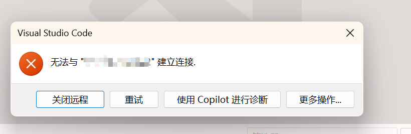
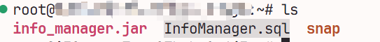

# TaskX的笔记在这里

## X.1 回来吧，村里发服务器了😭😭😭

​	先在`阿里云`上搞一台三个月试用的免费云服务器来😋😋😋


## X.2 我真得控制你了😡😡😡

​	我要先**远程连接**到我的阿里云服务器上

### X.2.1 出师不利

​	但是使用`ssh root@<服务器ip>`后，一个劲儿报错😭😭😭



​	把错误日志喂给`Gemini`，看他怎么说	


​	嗯……这之后`Gemini`告诉我要去配置**SSH密钥登录**

​	好吧那么我们就开干

### X.2.2 密钥是什么药💊

- **密钥对**分为**私钥**和**公钥**，私钥*唯一*对应一把公钥、公钥也*唯一*对应一把私钥

  只要把公钥存储到服务器端，那么服务器就可以验证访问用户是否拥有对应的私钥

  如果访问用户拥有对应的私钥，那么他就是可以信任的用户

- 首先现在本地生成**SSH密钥对**

  在`Powershell`中输入`ssh-keygen -t rsa -b 4096`后会出现以下提示，目前先不用管，全部回车跳过即可

```bash
# 设置密钥保存路径，直接默认
Enter file in which to save the key (C:\Users\qimin/.ssh/id_rsa):
# 设置密钥的passphrase，也就是以后在使用密钥的时候需要再确认一次这个passphrase，相当于双层保险
# 但是也会更加麻烦，所以默认空即可
Enter passphrase (empty for no passphrase): 
Enter same passphrase again:
```

​		这之后就又生成了两个神奇东西：


​	第一个`key fingerprint`是用于校验公钥是否正确的

​	第二个`randomart image`是根据`key fingerprint`生成的，方便人类快速校验公钥是否正确的图像

- 这之后就要把公钥存储到服务器上去

  输入这么一堆指令之后就可以把公钥存储到服务器端了

​	

- 在这之后重新登录...

  

​		We Did it!~~**(朵拉音)**~~

## X.3 怎么还要配环境😵😵😵

- 看看我们都要配置什么环境

  - `JDK` - 最基本的东西
  - `MySQL` - 数据库的搭载
  - `Maven` - 配置最基本的东西的东西
  - `Ngnix` - 配置反向代理，也就是为服务器服务的代理

- 那就一个个来吧

  

​		

​				

​		

## X.4 老板，打包带走！🫡🫡🫡

​	配置好了基本的环境之后，我们就要将本地内容逐步转移到服务器上了

### X.4.1 转移`jar`

- 首先我需要在开发机中使用`mvn package`打包项目

- 然后将打包好的`jar`复制到服务器上

  也就是输入这个指令

  `scp target/info-manager-0.0.1-SNAPSHOT.jar root@<server_ip>:/root/info_manager.jar`

- 但是输入之后终端显示`Permission Denied`

  应该是因为我是通过连接到`WSL`的终端输入的这行指令

  服务器只认识我的`Windows`主机，却不认识我的`WSL`小弟

- 所以我需要将主机中的`.ssh`文件夹复制到`WSL`的主目录里

  这之后还要用`chmod`将`.ssh`文件夹设置为`700`，将`id_rsa`设置成`600`

- 然后再次输入就没问题了

  

  在服务器中也确实看到了`jar`文件

  

​		这说明我们确实大功告成了🫡🫡🫡

### X.4.2 转移`MySQL`数据库

- 首先要把`WSL`中的数据库导出成`.sql`文件

  其实就是把数据库中的结构和内容都给转换成`SQL`，然后再次执行就可以得到一模一样的数据库

  这一步可以直接在`VS Code`的`MySQL`插件中通过图形化界面处理，十分方便

  

- 下一步就是使用`scp`将`.sql`复制到服务器上

  

  成功！

- 接下来就是在服务器上运行这些`SQL`了

  - 先进入`MySQL`使用这个语句创建好一个数据库：`CREATE DATABASE InfoMangaer;`

  - 然后使用`EXIT;`退出回到`bash`，并使用`mysql InfoManager < InfoManager.sql`来运行那一堆`SQL`

  - 然后回到`MySQL`使用`SHOW TABLES`来查看结果

    

​				成功！

## X.5 团结、精确、完美 😎😎😎

- 好了让我们来试着运行一下`java -jar info_manager.jar`

  

​		成功！

- 再用`POSTMAN`测试一下能否正确访问

  

​		发现访问超时了

​		问了一下`Gemini`，原因是在阿里云客户端上我没有开放`port:8080`的访问权限

- 让我们配置一下

  

- 之后再测试一下...

  

​		成功！

## X.6 完结撒花！！！🥳🥳🥳 

### **后记**

​	到目前为止，后端方向的招新题目可以说基本完成了。

​	在这个过程中，我学习到了不少东西：

- `Spring Boot`怎么用？三层架构又是啥？
- `Spring Security`怎么个流程？怎么使用？
- `MySQL`是个啥？要怎么用？
- `MyBatis`又是啥？
- `POSTMAN`是什么玩意儿？怎么用？
- `JWT`是什么高科技东西？
- `HTTP`通信的一些宝宝级知识。

​	只是不管怎么说，这些东西就算再怎么看起来花里胡哨，也都还只是最基础的那一批东西。这一个月的学习成果在AI面前也只有分分钟被秒杀的份~~（其实就算是未来好几年的学习成果也会被秒杀）~~。

​	但是对于作为一个在九月初连怎么用`Git`还一头雾水的人来说，发现自己学会了挺多东西，也还是很让人满足的。

​	这一个半月以来一点点地敲代码、一条条地问AI、一片片地Debug——虽然有的时候真的让人不得不红温，但总的来说还是让我找回了许久未得的充实感。来到电子科技大学有十三个月了，这还真是第一次。

​	费劲种了树，马上就能乘了凉；辛苦播了种，立刻就能吃上果——能马上看到自己的劳动成果是件很幸福的事。而我们这些臭敲代码的，好巧不巧就能享受到这一种幸福。忙活一下午，写了百来行代码，点一下调试就知道成没成——相较于其他大多数行当，这点儿幸福可以说只有我们在独占了。或许也正是因为这种独特的优势，在整个学习过程中，我都感觉很快乐。不过“快乐”这个词可能有些过头了，但是我从来没有感觉到过枯燥和无聊，这绝对是原原本本的写实。所以我很庆幸，能学一门我自己没那么讨厌的专业、能干一个不让我生厌作呕的行当。

​	所以，能不能和我敲一辈子代码，一休尼！🥺🥺🥺